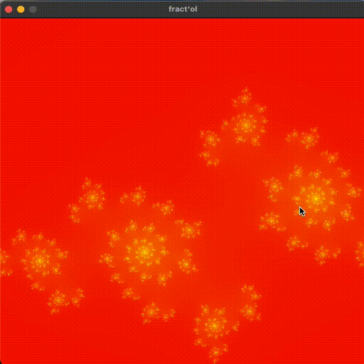

## Fractol

Fractol is a tool for visualizing and exploring various fractals. It provides an interactive interface to generate, manipulate, and analyze fractal patterns. It is a project done for the graphic branch at 42, so it is done in C.

### Features

Fractal Generation: Generate and visualize popular fractals like the Mandelbrot set, Julia set, and more.
Interactive Exploration: Zoom in and out, pan around, and adjust parameters in real-time.
Customization: Customize colors, iterations, and other properties to create unique fractal images.

### Some pretty pictures :

  
  
  
   
  

